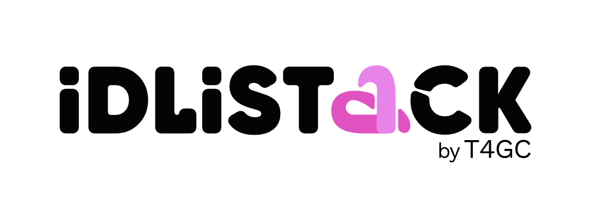

# Tech De-jargoniser by IDLIStack (T4GC)

> **Translate tech speak into everyday social impact English.**  
> An interactive engagement activity designed for the **IDLIStack Annual Summit 2026**.



---

## 🌟 Overview

At non-profit and social sector summits, leaders, program managers, and donors are frequently inundated with technical jargon from developers, vendors, and consultants (*"Just use the API to pull the donor list"*, *"We need to containerize the database in Docker"*, *"The webhook failed"*, etc.).

The **Tech De-jargoniser** bridges this gap through a clean, Google Translate-inspired interface matching **IDLIStack's official brand identity** (`idlistack.com` by Tech4Good Community / T4GC).

---

## ✨ Features Built for the Summit Booth

1. **Google-Translate-Style Split Interface**:
   - **Left Pane (Source Input)**: Type, paste, or select any tech jargon phrase.
   - **Right Pane (De-jargonised Output)**: Instant plain-English explanation using intuitive everyday metaphors (e.g. *API = waiter delivering orders between table and kitchen*, *Docker = standardized shipping containers*, *SSL = wax-sealed tamper-proof envelope*).
   - **Impact Takeaway Badge**: Explains *"What this means for your non-profit / project"*.

2. **Bidirectional Translation (Tech ⇆ Non-Tech)**:
   - **Tech English ➔ Non-Tech English**: De-mystifies developer speak into plain social impact language.
   - **Non-Tech English ➔ Tech English**: Click the **`⇆` Swap** button to turn plain requests (*"How do we automatically email donors on Mondays?"*) into real technical specifications (*"Set up a recurring Cron Job to hit the Listmonk API"*).

3. **Widely Used Phrases Wall**:
   - One-click interactive chips: `Docker`, `SSL Certificate`, `Traffic spike`, `Plugin`, `Cron Job`, `Webhook`, `API`, `Database`, `Open Source`, `CI/CD`, `Cache`, `Microservices`, `Latency`, `2FA`, and more.

4. **"Get Your Card" & Downloadable Summit Card**:
   - Clicking **"Get Your Card"** opens a branded modal.
   - Generates an instant high-resolution PNG image card with the IDLIStack Summit branding, ready to download or share on LinkedIn/Twitter/WhatsApp.

5. **Booth Engagement Activities**:
   - 🎮 **De-jargon Quiz Challenge**: A fast-paced, randomized **5-question interactive game** served automatically behind the scenes (from a curated bank of open-source and tech questions, with shuffled answers). Attendees get an instant personalized downloadable Scorecard to show at the booth for stickers/swag.
   - 🎲 **Surprise Me / Jargon Bingo**: Randomly pulls hilarious real-world buzzwords commonly heard in NGO tech meetings.
   - 🎙️ **Voice Input (Speech-to-Text)**: Attendees can tap the microphone and speak jargon directly into the booth mic.
   - 🔊 **Read Aloud (Text-to-Speech)**: Speaks the translation aloud with smooth browser synthesis.
   - 📱 **Mobile QR Code**: Attendees can scan a QR code on the booth screen to run the tool on their own phones (dynamically shows the exact hosting URL).
   - 🖥️ **Fullscreen Kiosk Mode**: One-click fullscreen display for iPad stands or large TV displays.

---

## 🚀 How to Run Locally

Because the project is built with lightweight, zero-dependency HTML5, CSS3, and ES6 JavaScript, you can run it immediately without any build steps:

### Option 1: Python HTTP Server (Recommended)
```bash
python3 -m http.server 4321
```
Then open [http://localhost:4321](http://localhost:4321) in your browser.

### Option 2: Node.js (npx serve)
```bash
npx serve -l 4321
```

### Option 3: Double-Click
Simply open `index.html` directly in Chrome, Safari, Firefox, or Edge.

---

## 📂 Project Structure

```
tech-dejargon/
├── index.html            # Clean attendee-facing UI with summit modals & tools
├── css/
│   └── style.css         # IDLIStack branding, pink accents, responsive layout
├── js/
│   ├── dictionary.js     # 60+ curated jargon terms, analogies, & impact notes
│   ├── app.js            # Translation engine, 5-question quiz, silent backend sheet logger
│   └── qrcode.min.js     # Standalone QR generator
├── assets/
│   ├── logo-black.png    # Official IDLIStack by T4GC logo
│   └── icon.svg          # Brand icon & favicon
└── README.md             # Documentation and Summit guide
```

---

## 🎨 Branding Alignment with IDLIStack (`idlistack.com`)

| Element | IDLIStack Brand Specification |
|---|---|
| **Primary Color** | `#ED4690` (Signature IDLIStack Hot Pink) |
| **Secondary Color** | `#111827` (Deep Slate / Charcoal) |
| **Card Border** | `2.5px solid #ED4690` with ambient soft pink glow |
| **Typography** | Inter & Manrope (Google Fonts) |
| **Philosophy** | Open-source hosting made effortless for impact organisations (T4GC) |

---

## 🎪 Summit Booth Setup Recommendations

1. **Hardware**: An iPad or touchscreen monitor on a stand at the IDLIStack booth.
2. **Kiosk Mode**: Click the **Kiosk** button in the top right corner to go fullscreen.
3. **Engagement Flow**:
   - Ask visitors: *"What tech word did a developer or vendor say that confused you?"*
   - Let them speak into the mic or type it in.
   - Have them click **"Get Your Card"** to download their custom de-jargonised card.
   - Encourage them to try the **5-question Open Source Quiz** to win IDLIStack stickers and download their official Scorecard!

---

## 📊 Silent Google Sheet Leaderboard Backend

The application records attendee names, quiz scores, accuracy percentages, and certification ranks **silently in the backend**. 

> [!NOTE]
> **100% Attendee-Friendly**: There are **zero** developer dialogs, setup modals, or sync indicators shown on the frontend. Attendees only see their clean scorecard, while their submission is logged automatically behind the scenes.

### 60-Second Organizer Setup:

1. Create a new Google Sheet (e.g. named `IDLIStack Summit 2026 Quiz Leaderboard`).
2. In Google Sheets, click **Extensions > Apps Script**.
3. Replace any code with this snippet:
```javascript
function doPost(e) {
  try {
    var sheet = SpreadsheetApp.getActiveSpreadsheet().getActiveSheet();
    if (sheet.getLastRow() === 0) {
      sheet.appendRow(["Timestamp", "Attendee Name", "Score", "Accuracy", "Rank", "Level", "Device"]);
      sheet.getRange(1, 1, 1, 7).setFontWeight("bold").setBackground("#ED4690").setFontColor("#FFFFFF");
    }
    var data = JSON.parse(e.postData.contents);
    sheet.appendRow([
      data.timestamp || new Date().toISOString(),
      data.name || "Anonymous",
      data.score || "0/5",
      (data.accuracy || 0) + "%",
      data.rank || "Explorer",
      data.level || "Standard",
      data.userAgent || ""
    ]);
    return ContentService.createTextOutput(JSON.stringify({status: "ok"})).setMimeType(ContentService.MimeType.JSON);
  } catch(err) {
    return ContentService.createTextOutput(JSON.stringify({status: "error", message: err.toString()})).setMimeType(ContentService.MimeType.JSON);
  }
}
```
4. Click **Deploy > New deployment**:
   - **Type**: Web app
   - **Execute as**: Me
   - **Who has access**: **Anyone** *(Crucial for silent web logging without requiring attendee logins)*
5. Copy the generated **Web App URL** (`https://script.google.com/macros/s/.../exec`).
6. Set the backend URL in either of two ways:
   - **Option A (Code - Recommended)**: Open [js/app.js](file:///Users/abhi/Documents/Projects/tech-dejargon/js/app.js) and paste your URL on line 12:
     ```javascript
     const GOOGLE_SHEET_BACKEND_URL = "https://script.google.com/macros/s/.../exec";
     ```
   - **Option B (Booth URL Query Param)**: Open the booth browser with `?sheet=<YOUR_URL>`, e.g.:
     `http://localhost:4321/?sheet=https://script.google.com/macros/s/.../exec`
     The URL parameter will be silently stored in the browser's local storage and used for all subsequent attendee submissions.

### Offline Resilient:
If venue Wi-Fi momentarily drops during the summit, attendee submissions are automatically queued in the browser's local storage and flushed silently to Google Sheets as soon as internet connectivity resumes.

